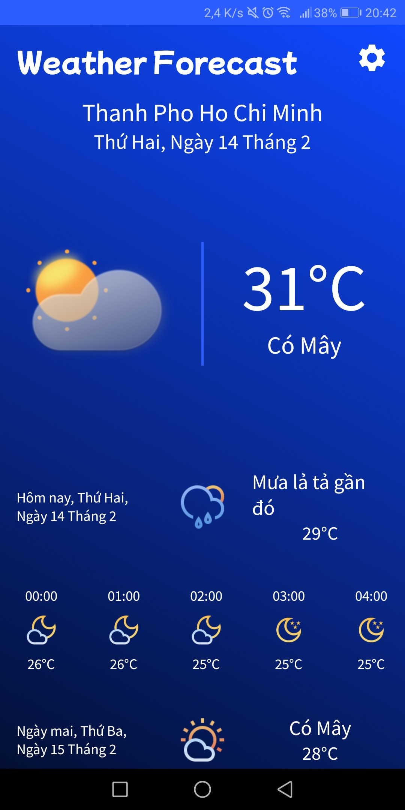

 

  <h2 align="center">Weather Forecast</h2>

  

    Real-time weather and Weather Forecast in the next 3 days, daily and hourly.
     
  

<!-- ABOUT THE PROJECT -->

## About The Project

This project is inspired and cloned base on some other weather forecast application.

Key features:

* Current weather information, like temperature, status, humidity, feels like weather, visibility,
  cloudy,...
* See forecast weather for the next 3 day, with status indicate hourly.
* Flexibly change location by searching, or use current position to get location.

### Built With

This project use:

* [Android Native](https://developer.android.com/) for application.
* [WeatherAPI](https://www.weatherapi.com/) for weather forecast information and location pickup.
* Graphic resources:
  https://www.figma.com/community/file/1059229179375580154
  https://www.figma.com/community/file/972934576657989859

### Demo

  

<!-- LICENSE -->

## License

Distributed under the MIT License.

(<a href="#top">back to top</a>)

